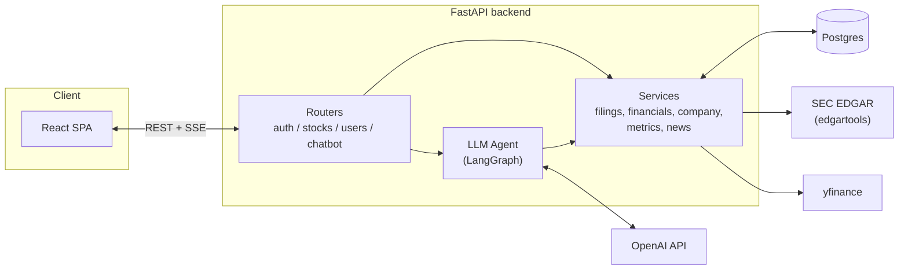
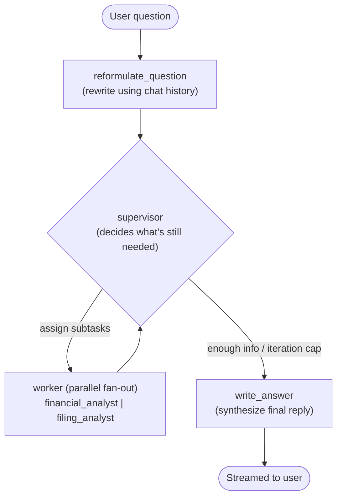

# yuRi Reasearch App

A stock research app that pairs SEC filing / financial data with an LLM assistant that can actually reason about it. FastAPI backend, React/Vite frontend, LangGraph-orchestrated chatbot.

## Stack

| Layer | Tech |
|---|---|
| Backend | FastAPI, SQLModel (SQLAlchemy 2.0), Postgres, Alembic |
| Auth | JWT (`python-jose`) + Argon2 password hashing |
| LLM | LangChain + LangGraph, OpenAI |
| Data sources | `edgartools` (SEC EDGAR), `yfinance` |
| Frontend | React 19, TypeScript, Vite, React Router |

---

## Architecture

The backend is thin at the router layer:

- **Routers** handle auth and request validation only.
- **Services** own caching, external fetches, and DB writes — for both REST endpoints *and* the LLM agent's tools.

> **Design decision — services own caching and fetching, routers stay thin.**
> Routes never talk to EDGAR/yfinance or the cache directly — they call into the service layer, and so do the LLM agent's tools. The REST API and the assistant's tools are backed by the exact same function for a given piece of data, not two parallel implementations that can quietly drift apart.

---

## Agentic pipeline

The assistant is a **supervisor/worker graph** built with LangGraph, not a single prompt-and-tools loop.

### Nodes

| Node | Role |
|---|---|
| `reformulate_question` | Rewrites a follow-up ("what about last year?") into a standalone question using chat history, so downstream nodes don't need the full conversation. |
| `supervisor` | A structured-output LLM call (`is_complete` + a list of subtask assignments). Can dispatch several workers in the same turn (LangGraph `Send`), capped at a max iteration count as a guardrail against infinite tool-calling loops. |
| `worker` | Dispatches to one of the two specialist workers below. |
| `write_answer` | The only node whose output is user-visible; synthesizes everything the workers found into one final answer. |

### Specialist workers

Each worker is its own small tool-calling agent (`langchain.agents.create_agent`) with its own system prompt and a narrow, non-overlapping tool set — the supervisor picks which worker(s) to invoke per subtask, not which tools to use.

| Worker | Tools | Answers questions about |
|---|---|---|
| `financial_analyst` | `fetch_financial_statement`, `list_metrics`, `get_metrics` | Revenue, margins, growth, computed metrics/ratios |
| `filing_analyst` | `fetch_filing_section`, `list_8k_filings`, `fetch_8k_filing` | Business description, risk factors, MD&A, recent 8-K events |

> **Design decision — multiple specialist workers instead of one general agent.**
> Multiple Workers allow for parallel gathering across different domains. Apart from that, it also allows each worker (agent) to be specialised in one single aspect instead of forcing a response from a single worker 

### Streaming

- LangGraph emits one interleaved stream of every node's activity.
- The backend filters that stream so **only `write_answer`'s tokens become real text on screen**. Every earlier node (supervisor deciding, workers fetching data) instead emits a short status update — *"Thinking…"*, *"Gathering data…"*.
- Result: a live "typing" response with no dead air, without leaking intermediate reasoning as garbled partial text.

**Path**: `graph.stream()` (SSE from FastAPI) → raw `fetch` + a manual `ReadableStream` reader on the frontend (not `EventSource`, since the request needs a POST body and an auth header) → tokens appended one at a time to the chat UI.

> **Design decision — persist before generating, not after.**
> The user's message and their daily-message-limit counter are committed *before* the LLM call starts, and the assistant's reply is persisted in a `finally` block. A failed generation or a client disconnect can never lose the question or let a call dodge the rate limit.

---

## Data sources

Two external sources feed the app, both wrapped behind service modules so the LLM tools and the REST API read from identical logic.

### SEC EDGAR (`edgartools`)

| | |
|---|---|
| **Scraped** | Latest 10-K (business description, MD&A, risk factors), latest 10-Q (MD&A), 8-K filings, Financial statements |
| **Handled** | Financial Statements require pre-processing to clean uneccessary dimensions|
| **Served via** | `GET /stocks/{ticker}/statements/{statement}`, `GET /stocks/{ticker}/summary`; the same functions are also exposed as LangChain tools (`fetch_financial_statement`, `fetch_filing_section`, `list_8k_filings`, ...) |

> **Design decision — extract, don't summarize, source documents.**
> Filing text goes through a cheap "extractor" LLM pass that pulls verbatim relevant passages before an analyst ever sees it, rather than summarizing it. Answers stay traceable to the actual filing text instead of a lossy summary of a summary.

> **Design decision — Only Annual Reports are cached**
> From Annual filing data we extract relevant sections, financial statements and later an AI-generated summary. Since parsing annual reports requries heavy proccessingis, the outputs are cached in Postgres keyed by the filing's accession number — a new annual report invalidates the cache, and a failed refetch falls back to the last good cached copy rather than erroring. Filings change rarely and irregularly, so invalidating on a new filing (rather than a TTL) avoids both stale data and unnecessary re-fetching. 

> **Design decision — Cache is triggered by users**
> The more the users search stocks, the more content is cached, to allow for faster response times.

> **Design decision — Smaller Filings are scraped live**
> Apart from annual report (10-K), the rest of the filings are scraped/parsed live on request. The time it takes for this proccess is negligible.

### yfinance

| | |
|---|---|
| **Scraped** | Live price/quote data, price history, company metadata (industry, market cap, analyst targets), news |
| **Served via** | `GET /stocks/{ticker}/prices`, `GET /stocks/{ticker}/overview`, `GET /stocks/{ticker}/news` |

> **Design decision — no caching for market data.**
> This data is cheap to fetch and changes constantly, so persisting it would just mean serving stale prices — it's fetched live on every request instead.

---

## Core features

### Auth

- JWT-based, stateless.
- Register/login issue a signed token (`sub`, user id, expiry).
- Every protected route depends on a typed `CurrentUser` dependency that decodes and validates it.
- Passwords are hashed with Argon2.
- A rolling daily message-limit counter on the user record throttles chatbot usage (admins are exempt).

### Watchlist

- A plain many-to-many link table between users and stocks.
- Users can add/remove a ticker and see their full watchlist on the home page.

### Chatbot / assistant

Scoped to one company at a time, from that company's stock page. A user can:

- ask business, financial, or filing questions and get a streamed, cited-in-context answer via the pipeline described above;
- see prior chat sessions for that ticker and resume any of them;
- start a new session (created lazily on the first message, not on clicking "new chat," to avoid empty session clutter);
- delete a session (falls back to the next most recent, or a fresh draft).
